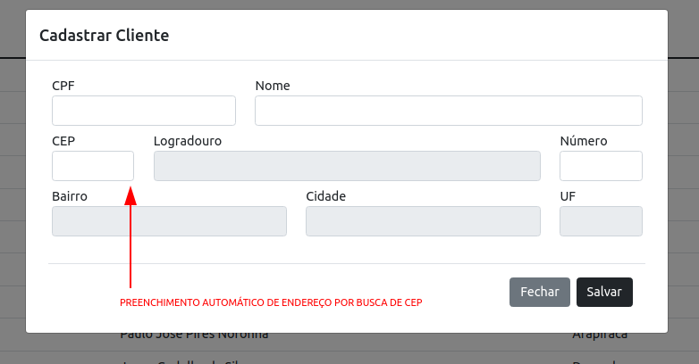
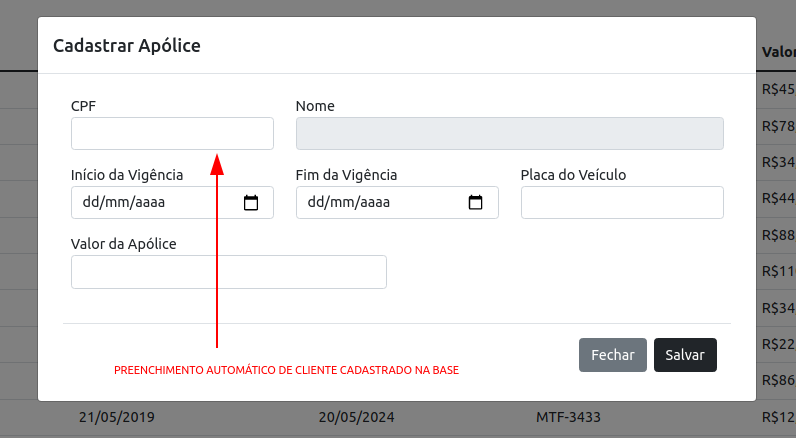

# Seguradora Gold - Backend

## Desafio Técnico

Esta aplicação consiste em um mini sistema gerenciador de apólices de seguros
e seus respectivos clientes.

Trata-se de um relacionamento entre Clientes e Apólices, onde um Cliente pode ter
muitas Apólices e uma Apólice pode ter somente um Cliente.
 
##### Como rodar localmente essa aplicação:

* Na raiz do projeto digite os seguintes comandos:
> mvn clean package
>
> docker build -t seguradora-gold-server .
>
> docker run -p 8080:8080 seguradora-gold-server
>

* Banco de dados relacional H2 em memória. Para acessar use:

> http://localhost:8080/h2-console/
>

* JDBC URL: jdbc:h2:mem:testdb
* User Name: sa
* Password:

A senha é em branco.

##### Navegação sugerida do sistema

* Criar um cliente
* Criar uma apólice vinculando à um cliente já existente na base

##### Observações

Não é possível excluir um cliente vinculado à uma ou mais Apólices, para isso é necessário que seja feito primeiramente a exclusão das Apólices vinculadas. 
Somente após isso o Cliente poderá ser excluído.

##### Detalhes importantes

Para inserir os registros no sistema procure um botão com sinal ' + '.

Na modal de cadastro de cliente, o campo CEP está programado para autocompletar os demais campos referentes à endereço.

Na modal de cadastro de apólice, o campo CPF está prgramado para autocompletar o nome do cliente, o qual será vinculado à apólice. Para isso, é necessário que o cliente já esteja cadastrado na base de dados.

### Endpoints API

#### Cliente:   

* localhost:8080/clientes GET , POST , PUT
* localhost:8080/clientes/{id} GET , DELETE
* localhost:8080/clientes/cpf/{cpf} GET
* localhost:8080/clientes/page GET

#### Apólice:   

* localhost:8080/apolices GET , POST , PUT
* localhost:8080/apolices/{id} GET , DELETE
* localhost:8080/apolices/cliente/{idCliente} GET 
* localhost:8080/apolices/cliente/cpf/{cpfCliente} GET
* localhost:8080/apolices/page GET

#### CEP Controller:   

* localhost:8080/cep/{cep} GET

